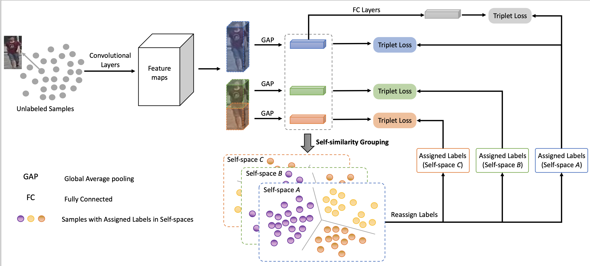

# Self-similarity Grouping: A Simple Unsupervised Cross Domain Adaptation Approach for Person Re-identificatio(SSG)
Implementation of the paper [Self-similarity Grouping: A Simple Unsupervised Cross Domain Adaptation Approach for Person Re-identification](https://arxiv.org/abs/1811.10144), ICCV 2019 (Oral)


The SSG approach proposed in the paper is simple yet effective and achieves the state-of-arts on three re-ID datasets: Market1501, DukdMTMC and MSMT17.



<!-- ## Setup

1. Datasets (source dataset and target dataset).
2. Pre-trained (on source dataset) model.

## Requirements

- PyTorch -->

## Running the experiments

### Step 1: Train on source dataset

Run `source_train.py` via

```shell
python source_train.py \
    --dataset <name_of_source_dataset>\
    --resume <dir_of_source_trained_model>\
    --data_dir <dir_of_source_data>\
    --logs_dir <dir_to_save_source_trained_model>
```

To replicate the results in the paper, you can download pre-trained models on Market1501, DukeMTMC and MSMT17 from [GoogleDrive](https://drive.google.com/file/d/1Z94qbsjuAQ9sLeEzURPstQxa3gluZIPJ/view?usp=sharing). There maybe some bugs in source_train.py, please refer to [DomainAdaptiveReID](https://github.com/LcDog/DomainAdaptiveReID) to obtained the pretrained model or just use the pretrained model provided by us.
And you can find all models after adaptation from [GoogleDrive](https://drive.google.com/file/d/1BUp1fbjKTZGjL8WGCx3yUp2GXD10EdxC/view?usp=sharing). Our models can be trained with __PyTorch 0.4.1__ or __PyTorch 1.0__.

### Step 2: Run Self-similarity Grouping

```shell
python selftraining.py \
    --src_dataset <name_of_source_dataset>\
    --tgt_dataset <name_of_target_dataset>\
    --resume <dir_of_source_trained_model>\
    --iteration <number of iteration>\
    --data_dir <dir_of_source_target_data>\
    --logs_dir <dir_to_save_model_after_adaptation>\
    --gpu-devices <gpu ids>\
    --num-split <number of split>
```
Or just command
```shell
./run.sh
```
### Step 3: Run Clustering-guided Semi-Supervised Training
```shell
python semitraining.py \
    --src_dataset <name_of_source_dataset>\
    --tgt_dataset <name_of_target_dataset>\
    --resume <dir_of_source_trained_model>\
    --iteration <number of iteration>\
    --data_dir <dir_of_source_target_data>\
    --logs_dir <dir_to_save_model_after_adaptation>\
    --gpu-devices <gpu ids>\
    --num-split <number of split>\
    --sample <sample method>
```

## Results

### Step 1: After training on source dataset

| Source Dataset | Rank-1 | mAP |
| :--- | :---: | :---: |
| DukeMTMC | 82.6 | 70.5 |
| Market1501 | 92.5 | 80.8 |
| MSMT17 | 73.6 | 48.6 |

### Step 2: After adaptation

<!-- markdownlint-disable MD033 -->
<table>
    <tr>
        <th rowspan="2">SRC --&gt; TGT</th>
        <th colspan="2">Before Adaptation</th>
        <th colspan="2">Adaptation by SSG</th>
        <th colspan="2">Adaptation by SSG++</th>
    </tr>
    <tr>
        <td>Rank-1</td>
        <td>mAP</td>
        <td>Rank-1</td>
        <td>mAP</td>
        <td>Rank-1</td>
        <td>mAP</td>
    </tr>
    <tr><td>Market1501 --&gt; DukeMTMC</td><td>30.5</td><td>16.1</td><td>73.0</td><td>53.4</td><td>76.0</td><td>60.3</td></tr>
    <tr><td>DukeMTMC --&gt; Market1501</td><td>54.6</td><td>26.6</td><td>80.0</td><td>58.3</td><td>86.2</td><td>68.7</td></tr>
    <tr><td>Market1501 --&gt; MSMT17 </td><td>8.6</td><td>2.7</td><td>31.6</td><td>13.2</td><td>37.6</td><td>16.6</td></tr>
    <tr><td>DukeMTMC --&gt; MSMT17 </td><td>12.38</td><td>3.82</td><td>32.2</td><td>13.3</td><td>41.6</td><td>18.3</td></tr>


</table>

## Issues
* The pre-trained model is trained with Pytorch 0.4.1, there may be some  error when loading it by Pytorch with higher version. This [link](https://github.com/CSAILVision/places365/issues/25#issuecomment-333871990) should be helpful
* The source_training.py codes may have some bugs, I suggest you directly using our pretrained baseline model. And I will fix the bugs soon.
* To reproduce results listed in paper, I recommend to use two GPUs with batch size of 32. And in general, the experimental results may have be a little different from the results listed in paper (+/-1%).

## Acknowledgement

Our code is based on [open-reid](https://github.com/Cysu/open-reid) and [DomainAdaptiveReID](https://github.com/LcDog/DomainAdaptiveReID).

## Citation
If you find the code helpful in your resarch or work, please cite the following paper.
```
@InProceedings{Fu_2019_ICCV,
author = {Fu, Yang and Wei, Yunchao and Wang, Guanshuo and Zhou, Yuqian and Shi, Honghui and Huang, Thomas S.},
title = {Self-Similarity Grouping: A Simple Unsupervised Cross Domain Adaptation Approach for Person Re-Identification},
booktitle = {The IEEE International Conference on Computer Vision (ICCV)},
month = {October},
year = {2019}
}
```

